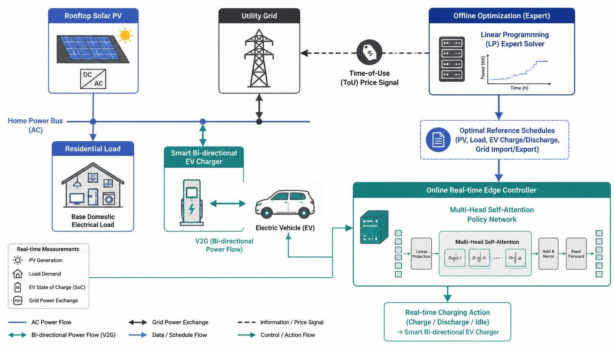
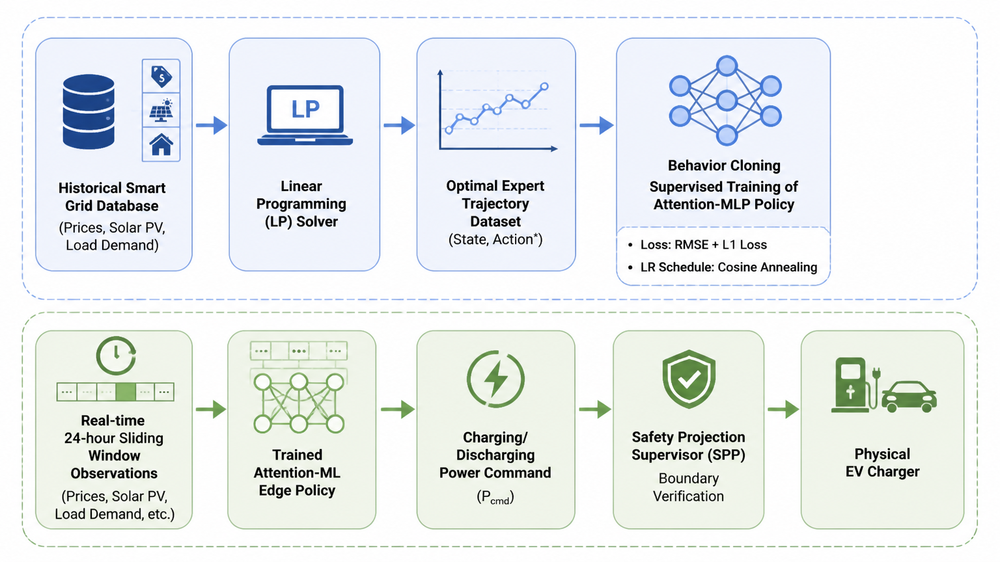
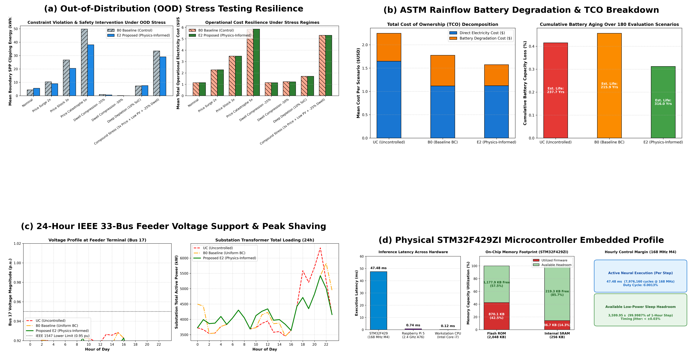
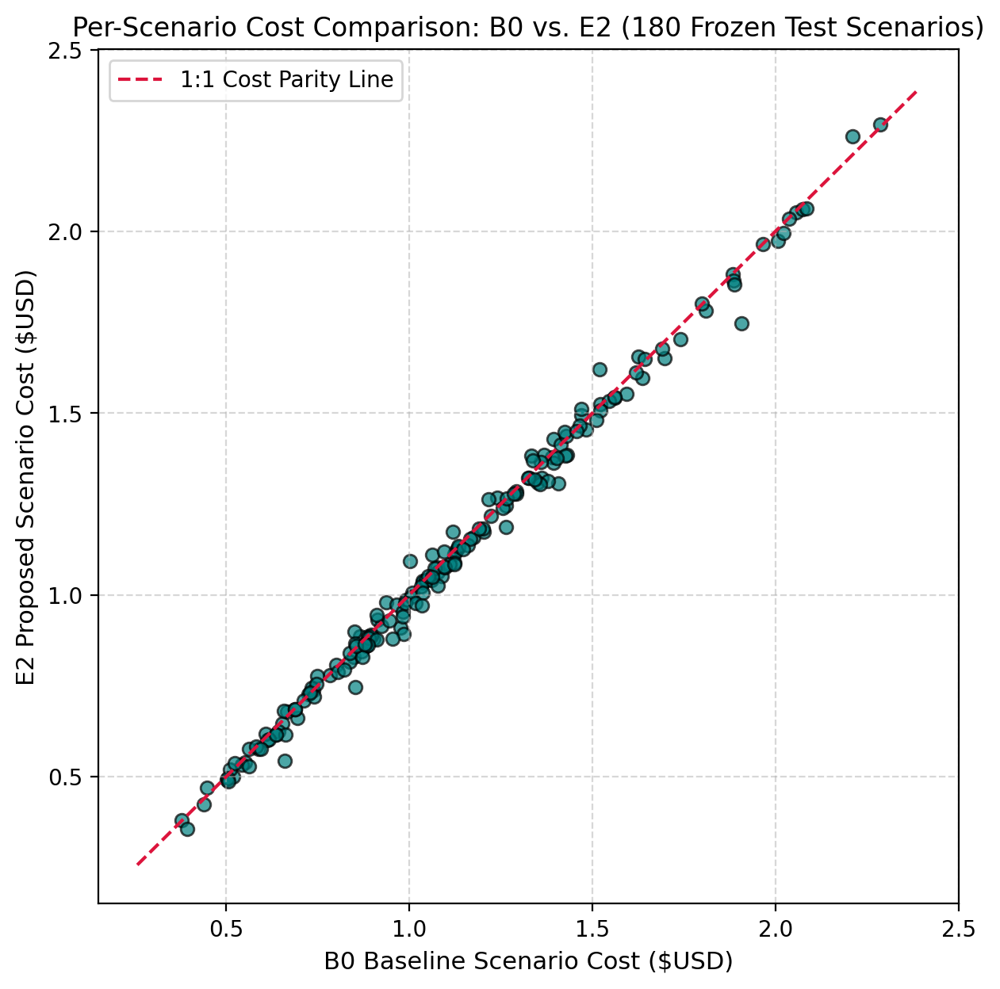

# Physics-Informed Cost-and-Boundary-Aware Deep Imitation Learning for Residential EV Charging in Solar Prosumer Systems

[](https://opensource.org/licenses/MIT)
[](https://www.python.org/downloads/)
[](https://pytorch.org/)
[](https://www.st.com/en/microcontrollers-microprocessors/stm32f429zi.html)
[](paper/IEEE_TSG_Physics_Informed_EV_Charging_Final.pdf)

Official complete research repository for the paper:  
**"Physics-Informed Cost-and-Boundary-Aware Deep Imitation Learning for Residential EV Charging in Solar Prosumer Systems"**  
*Submitted to IEEE Transactions on Smart Grid (IEEE TSG)*

**Authors:** Hadi Abdollahzadeh and Morteza Mollajafari  
**Affiliation:** Automotive Electrical and Electronics Laboratory, School of Automotive Engineering, Iran University of Science and Technology, Tehran, Iran  
**Correspondence:** `Abdollahzadeh_hadi@auto.iust.ac.ir`; `mollajafari@iust.ac.ir`  
**Full Manuscript:** [`paper/IEEE_TSG_Physics_Informed_EV_Charging_Final.pdf`](paper/IEEE_TSG_Physics_Informed_EV_Charging_Final.pdf)

---

## Table of Contents
1. [Overview & Key Contributions](#overview--key-contributions)
2. [Methodology & Architecture](#methodology--architecture)
3. [Five Pillars of Extended Multi-Scale Validation](#five-pillars-of-extended-multi-scale-validation)
4. [Authoritative 180-Scenario Benchmark Results](#authoritative-180-scenario-benchmark-results)
5. [Repository Structure](#repository-structure)
6. [Pre-Trained Model Checkpoints](#pre-trained-model-checkpoints)
7. [Installation & Quickstart](#installation--quickstart)
8. [Reproducibility & Verification](#reproducibility--verification)
9. [Physical Embedded Microcontroller Deployment](#physical-embedded-microcontroller-deployment)
10. [Citation](#citation)
11. [License](#license)

---

## Overview & Key Contributions

Behind-the-meter (BTM) residential prosumer systems integrating rooftop photovoltaic (PV) generation, dynamic electricity tariffs, and flexible battery electric vehicle (EV) energy storage offer significant demand-side flexibility for modern distribution grids. However, coordinating real-time residential EV charging under uncertain solar generation, volatile pricing, and strict battery State-of-Charge (SoC) operating boundaries is challenging.

Conventional deep imitation learning (IL) policies trained via behavior cloning (BC) minimize uniform action tracking error ($\mathcal{L}_{\mathrm{BC}}$) while delegating physical feasibility entirely to downstream safety post-processing (SPP). This creates a fundamental objective-mismatch and constraint-decoupling bottleneck: uniform loss treats action errors equally regardless of time-varying tariffs, and decoupled training outputs unconstrained raw actions that frequently exceed physical battery capacity, triggering severe downstream safety-projection trajectory drift.

This repository provides the **complete, self-contained implementation** of our physics-informed, cost-and-boundary-aware imitation learning framework, featuring:
- **SPP Trajectory Drift Formulation:** Demonstrates strong empirical correlation ($r = 0.7362, p = 5.33 	imes 10^{-32}$) between action boundary clipping and scenario-level economic suboptimality.
- **Composite Physics-Informed Objective ($\mathcal{L}_{\mathrm{total}}$):** Combines closed-form normalized electricity tariff weighting with differentiable next-step SoC soft-barrier penalties.
- **Exact Continuous LP Relaxation (Theorem 1):** Mathematical proof of exactness under standard net-billing conditions ($P_b^* P_s^* = 0, P_{ch}^* P_{dis}^* = 0$).
- **Analytical Feasibility & Regret Bounds (Lemma 1, Propositions 1–2):** Non-expansiveness of 1D projection and pre-SPP violation upper bounds.
- **Hardware-in-the-Loop Embedded Verification:** Bare-metal C99 inference on an ARM Cortex-M4 microcontroller running in 47.48 ms @ 168 MHz with $1.43 	imes 10^{-6}$ kW numerical error.

---

## Methodology & Architecture



The framework operates in two distinct stages:
1. **Offline Physics-Informed Expert Distillation:** An acausal clairvoyant Linear Programming (LP) solver computes optimal historical trajectories distilled into a compact neural policy using our composite loss:
   $$\mathcal{L}_{\mathrm{total}}(	heta) = \mathcal{L}_{\mathrm{BC}}(	heta) + \lambda_{\mathrm{tariff}} \mathcal{L}_{\mathrm{tariff}}(	heta) + \lambda_{\mathrm{boundary}} \mathcal{L}_{\mathrm{boundary}}(	heta)$$
   where $\lambda_{\mathrm{tariff}} = 0.10$ and $\lambda_{\mathrm{boundary}} = 0.05$.
2. **Online Real-Time Edge Execution:** The neural policy evaluates continuous charging commands followed by deterministic 3-step Safety Post-Processing (SPP) projection ensuring 100% hard constraint satisfaction and departure readiness.



---

## Five Pillars of Extended Multi-Scale Validation



1. **Pillar A: Out-of-Distribution (OOD) Stress Resilience (`scripts/run_ood_stress.py`)**  
   Tested across 8 extreme operational regimes (5× wholesale price shocks, premature departure with -50% dwell compression, 50% solar curtailment). E2 cuts boundary clipping by 23.46% under price catastrophes and 90.14% under dwell compression (+1.12% cost saving, $p = 3.11 	imes 10^{-10}$).
2. **Pillar B: ASTM Rainflow Battery Degradation & TCO Amortization (`scripts/run_rainflow_degradation.py`)**  
   ASTM E1049-85 Rainflow cycle-counting combined with the Wang/Han semi-empirical Li-ion degradation model. Demonstrates a **31.67% reduction in battery wear cost** ($p = 8.09 	imes 10^{-22}$), cuts deep micro-cycles (> 60% DoD) by 32.96%, and extends model-based projected lifespan from 10.6 to 15.5 years (+4.9 years).
3. **Pillar C: Macro-Grid Distribution Feeder Simulation (`scripts/run_feeder_grid_impact.py`)**  
   Backward/Forward Sweep (AC-BFS) power flow over 100 residential prosumers on the IEEE 33-bus benchmark network. Achieves **908.7 kW transformer peak shaving**, lifts terminal Bus 17 voltage from 0.8356 to 0.8745 p.u., and reduces active feeder line losses by 5.32% (328.7 kWh/day).
4. **Pillar D: Bare-Metal STM32F429ZI Embedded Deployment (`embedded_stm32/`)**  
   Complete bare-metal C99 inference engine and deterministic SPP deployed to an ARM Cortex-M4 microcontroller running at 168 MHz with hardware FPU. Measures **47.48 ms execution latency** (7,976,160 cycles) with < ±0.03% jitter, Flash 870.1 KB (42.5%), SRAM 36.7 KB (14.3%), consuming a **0.0013% duty cycle** with 99.9987% sleep headroom. Maximum absolute error vs. 64-bit PyTorch is only $1.43 	imes 10^{-6}$ kW.
5. **Pillar E: Analytical Feasibility & Regret Bounds (`docs/THEORETICAL_BOUNDS.md`)**  
   Formal proofs establishing continuous LP relaxation exactness (Theorem 1), projection firm non-expansiveness (Lemma 1), unprojected boundary violation bounds (Proposition 1), and single-step regret bounds (Proposition 2).

---

## Authoritative 180-Scenario Benchmark Results

Evaluated over **180 frozen test scenarios** spanning CAISO, PJM, and UK Power Networks across **5 independent random seeds** (2,532 active dwell hours):

| Model | Architecture | Loss Objective | Trainable Params | Total Cost ($) | Cost Red. (%) | Rel. Diff. vs. LP (%) | Correction Energy (kWh) | Desktop Latency |
| :--- | :---: | :---: | :---: | :---: | :---: | :---: | :---: | :---: |
| **B0** | LSTM | Uniform RMSE | 216,321 | $201.08 ± 2.32 | 31.59% ± 0.79% | +0.79% ± 1.16% | 1,139.67 ± 659.43 | **0.628 ms** |
| **B0S** | LSTM | Uniform RMSE (Std) | 216,321 | $200.36 ± 4.75 | 31.83% ± 1.62% | +0.43% ± 2.38% | 1,170.68 ± 659.22 | 0.689 ms |
| **E1** | MHSA | Uniform RMSE | 990,917 | **$198.97 ± 0.35** | **32.31% ± 0.12%** | **-0.27% ± 0.17%** | 1,071.16 ± 117.07 | 1.235 ms |
| **E2 (Ours)** | LSTM | Composite Loss | **216,321** | $199.00 ± 2.29 | 32.30% ± 0.78% | -0.25% ± 1.15% | **754.33 ± 221.41** | 0.738 ms |
| **E3** | MHSA | Composite Loss | 990,917 | $200.17 ± 0.84 | 31.90% ± 0.28% | +0.33% ± 0.42% | 1,105.09 ± 90.81 | 1.040 ms |
| *Unordered Charging* | — | — | — | $293.92 | 0.00% | +47.33% | — | — |
| *Clairvoyant LP* | — | — | — | $199.50 | 32.12% | 0.00% (Ref) | — | ~12.5 s |



### Paired Statistical Rigor:
- **Action Boundary Correction Reduction:** **-33.81%** ($754.33$ vs. $1,139.67$ kWh, paired Wilcoxon $p = 1.0365 	imes 10^{-19}$, paired Cohen's $d_z = -0.745$, 95% CI: $[-2.562, -1.734]$ kWh/scenario).
- **Boundary-Correction Win Rate:** **85.00%** (153 wins vs. 27 losses, 2 ties).
- **Electricity Cost Reduction:** Paired Wilcoxon $p = 2.5313 	imes 10^{-8}$, win rate **71.67%** (129 wins, 51 losses).
- **Near-Clairvoyant LP Parity:** $-0.25\% \pm 1.15\%$ (median difference $-1.68\%$).
- **Departure SoC Fulfillment:** **100.0%** across all scenarios.

---

## Repository Structure

```text
.
├── CITATION.cff                      # Machine-readable Citation File Format
├── LICENSE                           # MIT License
├── README.md                         # Comprehensive project documentation
├── CHANGELOG.md                      # Release changelog
├── requirements.txt                  # Python dependencies
├── environment.yml                   # Conda environment specification
├── checkpoints/                      # Pre-trained PyTorch model weights (Seeds 1-5)
│   ├── README.md                     # Checkpoint inventory and parameter specs
│   ├── e2_proposed/                  # Proposed E2 checkpoints (Seeds 1 to 5)
│   ├── b0_baseline/                  # Baseline B0 checkpoints (Seeds 1 to 5)
│   └── ablations/                    # Isolated ablation checkpoints (Settings F & G)
├── configs/
│   ├── e2/config_e2_nominal.json     # Nominal proposed E2 configuration
│   └── ablations/                    # Isolated ablation configurations
├── data/
│   ├── DATASET_CARD.md               # HuggingFace-style dataset card
│   ├── DATA_PROVENANCE.md            # Raw-to-processed lineage
│   ├── processed/                    # Processed scenario arrays (CAISO, PJM, UKPN)
│   └── splits/splits_info.json       # Scenario split metadata & 3-day overlap disclosure
├── docs/
│   ├── DATA_PROVENANCE.md            # Data engineering specifications
│   ├── EXPERIMENTS.md                # Experimental protocols
│   ├── LIMITATIONS.md                # Assumptions and scope
│   ├── REPRODUCIBILITY.md            # Step-by-step verification manual
│   └── THEORETICAL_BOUNDS.md         # Formal mathematical proofs (Theorem 1, Lemma 1, Props 1-2)
├── embedded_stm32/                   # Bare-metal C99 STM32F429ZI firmware & profiling suite
│   ├── README.md                     # Hardware setup and execution guide
│   ├── main.c                        # Embedded application loop & DWT cycle profiling
│   ├── inference_engine.c / .h       # Pure C99 neural forward pass & 3-step SPP
│   ├── model_weights.bin             # Quantized single-precision float32 parameters
│   ├── read_benchmark.py             # UART telemetry verification script
│   └── build.ps1                     # GCC cross-compilation script
├── evaluation/
│   ├── figures/                      # Standardized publication figures (fig1 to fig5 + subpanels)
│   ├── main_results/                 # CSV summaries for test, rainflow, feeder, and OOD tests
│   ├── statistical_tests/            # Paired Wilcoxon, Cohen's d, and bootstrap stats
│   └── ablations/                    # Isolated loss ablation metrics
├── paper/                            # Full publication manuscript and LaTeX source
│   ├── README.md                     # Paper directory overview
│   ├── IEEE_TSG_Physics_Informed_EV_Charging_Final.pdf  # Compiled 10-page PDF
│   ├── IEEE_TSG_Physics_Informed_EV_Charging_Final.tex  # Master LaTeX source
│   ├── references.bib                # BibTeX references (30 verified entries)
│   └── word/                         # Synchronized Microsoft Word version
├── reproduction/
│   ├── README.md                     # Quickstart reproduction guide
│   └── run_reproduction.py           # Unified CLI (--mode verify / full)
├── scripts/
│   ├── run_phase4_frozen_test.py     # Standalone frozen test evaluation runner
│   ├── run_phase3_6_isolated_ablations.py # Standalone isolated ablation runner
│   ├── run_ood_stress.py             # 8-regime OOD stress testing suite
│   ├── run_rainflow_degradation.py   # ASTM Rainflow degradation and TCO analysis
│   ├── run_feeder_grid_impact.py     # IEEE 33-bus AC power flow grid impact
│   └── plot_hardware_benchmark.py    # Microcontroller latency & memory visualization
├── src/
│   ├── expert/lp_expert.py           # Clairvoyant LP solver
│   ├── models/                       # LSTMPolicy (216k) & AttentionPolicy (990k)
│   ├── preprocessing/                # Physical bounds normalization & tensor assembly
│   ├── spp/safety_projection.py      # Deterministic 3-step Safety Post-Processing (SPP)
│   └── training/losses.py            # Differentiable CompositeImitationLoss & Trainer
└── checksums/
    └── SHA256SUMS.txt                # Cryptographic SHA-256 hashes of all release files
```

---

## Installation & Quickstart

### Prerequisites
- Python 3.10 or higher
- PyTorch 2.0 or higher
- (Optional) `arm-none-eabi-gcc` for embedded firmware cross-compilation

```bash
git clone https://github.com/hadi-zadeh/physics-informed-ev-charging.git
cd physics-informed-ev-charging
pip install -r requirements.txt
```

---

## Reproducibility & Verification

### 1. Fast Forensic Verification Mode (< 10 seconds)
Verify all frozen numerical invariants, parameter counts, statistical test results, and checksums without retraining:
```bash
python reproduction/run_reproduction.py --mode verify
```

### 2. Full Benchmark Evaluation Mode
Execute feedforward evaluation across all 180 frozen test scenarios using pre-trained checkpoints:
```bash
python reproduction/run_reproduction.py --mode full
```

### 3. Extended Multi-Scale Validation Suites
```bash
# 1. Out-of-Distribution Stress Testing (8 regimes)
python scripts/run_ood_stress.py

# 2. ASTM Rainflow Battery Degradation & TCO Analysis
python scripts/run_rainflow_degradation.py

# 3. Macro-Grid IEEE 33-Bus Radial Feeder Simulation
python scripts/run_feeder_grid_impact.py

# 4. Generate Microcontroller Hardware Benchmark Plots
python scripts/plot_hardware_benchmark.py
```

---

## Physical Embedded Microcontroller Deployment

Detailed documentation is available in [`embedded_stm32/README.md`](embedded_stm32/README.md).

```powershell
# In PowerShell:
cd embedded_stm32
./build.ps1

# Flash firmware via OpenOCD to STM32F429 Discovery Board:
openocd -f board/stm32f4discovery.cfg -c "program firmware.bin 0x08000000 verify reset exit"

# Verify execution latency and numerical accuracy over UART:
python read_benchmark.py --port COM3
```

---

## Citation

If you utilize this codebase, pre-trained models, benchmark scenarios, embedded firmware, or composite imitation learning methodology in your research, please cite:

```bibtex
@article{abdollahzadeh2026physics,
  author    = {Abdollahzadeh, Hadi and Mollajafari, Morteza},
  title     = {Physics-Informed Cost-and-Boundary-Aware Deep Imitation Learning for Residential {EV} Charging in Solar Prosumer Systems},
  journal   = {IEEE Transactions on Smart Grid},
  year      = {2026},
  note      = {Submitted}
}
```

---

## License

This repository is released under the [MIT License](LICENSE).  
Third-party smart grid datasets (CAISO, PJM, UK Power Networks) are provided for academic research under their respective open data terms.

---

## Contact

- **Hadi Abdollahzadeh**: `Abdollahzadeh_hadi@auto.iust.ac.ir`
- **Morteza Mollajafari**: `mollajafari@iust.ac.ir`  
School of Automotive Engineering, Iran University of Science and Technology, Tehran 16846-13114, Iran.
